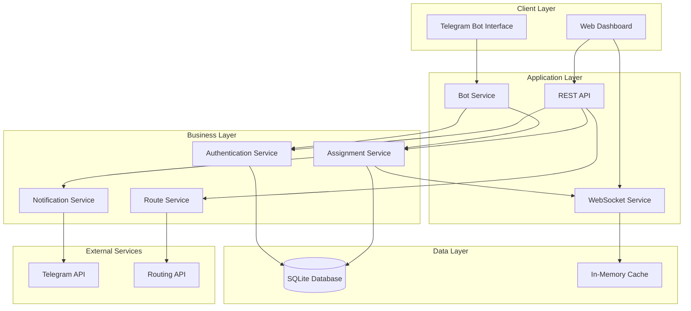

# Design Document: Taxi Management System

## Overview

The Taxi Management System is a comprehensive platform consisting of a Telegram bot and web interface for coordinating transportation services between couriers and passengers across multiple branches. The system enables real-time assignment management, automated notifications, and route optimization while maintaining data consistency across all interfaces.

The architecture follows a microservices-inspired approach with clear separation between the Telegram bot service, web API, and real-time synchronization layer. The system is designed for scalability, supporting up to 50 branches and 500 daily assignments while maintaining sub-2-second response times.

## Architecture

### High-Level Architecture



### Technology Stack

**Backend:**
- Node.js with Express.js framework
- SQLite3 database with Sequelize ORM
- Socket.io for real-time WebSocket communication
- node-telegram-bot-api for Telegram integration
- JWT for authentication
- Joi for data validation
- Winston for logging

**Frontend:**
- React.js with Vite build tool
- Material-UI (MUI) component library
- AG-Grid Community for data tables
- Redux Toolkit for state management
- Socket.io-client for real-time updates

**External Services:**
- GraphHopper API for route optimization
- Telegram Bot API for messaging

## Components and Interfaces

### Core Components

#### 1. Telegram Bot Service
**Responsibility:** Handle all Telegram bot interactions, user registration, and shift management.

**Key Interfaces:**
```typescript
interface BotService {
  handleStart(chatId: number): Promise<void>
  handleRegistration(chatId: number, userData: UserData): Promise<void>
  handleShiftRegistration(chatId: number, shiftData: ShiftData): Promise<void>
  sendNotification(userId: number, message: NotificationMessage): Promise<void>
}

interface UserData {
  role: 'passenger' | 'courier' | 'admin'
  fullName: string
  phone: string
  address: string
  branchId: number
  carInfo?: CarInfo // Only for couriers
}
```

#### 2. Assignment Service
**Responsibility:** Manage courier-passenger assignments and coordinate with notification system.

**Key Interfaces:**
```typescript
interface AssignmentService {
  createAssignment(assignment: AssignmentData): Promise<Assignment>
  updateAssignment(id: number, updates: Partial<AssignmentData>): Promise<Assignment>
  getAssignmentsByDate(date: Date, branchId?: number): Promise<Assignment[]>
  validateAssignment(assignment: AssignmentData): Promise<ValidationResult>
}

interface AssignmentData {
  courierId: number
  passengerIds: number[]
  date: Date
  branchId: number
  status: 'pending' | 'confirmed' | 'cancelled'
}
```

#### 3. Web API Service
**Responsibility:** Provide REST endpoints for web interface operations.

**Key Endpoints:**
```typescript
// Authentication
POST /api/auth/login
GET /api/auth/verify

// Users Management
GET /api/users
GET /api/users/:id
PUT /api/users/:id
DELETE /api/users/:id

// Assignments Management
GET /api/assignments/today
POST /api/assignments
PUT /api/assignments/:id
DELETE /api/assignments/:id

// Shifts Management
GET /api/shifts/today
GET /api/shifts/:date
POST /api/shifts
PUT /api/shifts/:id
```

#### 4. Real-time Synchronization Service
**Responsibility:** Maintain data consistency between web interface and Telegram bot.

**Key Events:**
```typescript
interface SyncEvents {
  'assignment:created': (assignment: Assignment) => void
  'assignment:updated': (assignment: Assignment) => void
  'assignment:deleted': (assignmentId: number) => void
  'shift:updated': (shift: Shift) => void
  'user:updated': (user: User) => void
}
```

#### 5. Route Optimization Service
**Responsibility:** Calculate optimal routes for courier assignments (Beta feature).

**Key Interfaces:**
```typescript
interface RouteService {
  calculateOptimalRoute(addresses: Address[]): Promise<RouteResult>
  exportRouteFile(route: RouteResult, format: 'gpx' | 'kml'): Promise<Buffer>
}

interface RouteResult {
  optimizedOrder: number[]
  totalDistance: number
  estimatedTime: number
  waypoints: Coordinate[]
}
```

## Data Models

### Database Schema

#### Users Table
```sql
CREATE TABLE users (
  id INTEGER PRIMARY KEY AUTOINCREMENT,
  telegram_id INTEGER UNIQUE NOT NULL,
  role ENUM('passenger', 'courier', 'admin') NOT NULL,
  full_name VARCHAR(255) NOT NULL,
  phone VARCHAR(20) NOT NULL,
  address TEXT NOT NULL,
  is_active BOOLEAN DEFAULT true,
  created_at DATETIME DEFAULT CURRENT_TIMESTAMP,
  updated_at DATETIME DEFAULT CURRENT_TIMESTAMP
);
```

#### Branches Table
```sql
CREATE TABLE branches (
  id INTEGER PRIMARY KEY AUTOINCREMENT,
  name VARCHAR(255) NOT NULL,
  address TEXT NOT NULL,
  is_active BOOLEAN DEFAULT true
);
```

#### Passengers Table
```sql
CREATE TABLE passengers (
  id INTEGER PRIMARY KEY AUTOINCREMENT,
  user_id INTEGER NOT NULL,
  branch_id INTEGER NOT NULL,
  FOREIGN KEY (user_id) REFERENCES users(id),
  FOREIGN KEY (branch_id) REFERENCES branches(id)
);
```

#### Couriers Table
```sql
CREATE TABLE couriers (
  id INTEGER PRIMARY KEY AUTOINCREMENT,
  user_id INTEGER NOT NULL,
  branch_id INTEGER NOT NULL,
  car_brand VARCHAR(100) NOT NULL,
  car_color VARCHAR(50) NOT NULL,
  car_plate VARCHAR(20) NOT NULL,
  FOREIGN KEY (user_id) REFERENCES users(id),
  FOREIGN KEY (branch_id) REFERENCES branches(id)
);
```

#### Shifts Table
```sql
CREATE TABLE shifts (
  id INTEGER PRIMARY KEY AUTOINCREMENT,
  user_id INTEGER NOT NULL,
  branch_id INTEGER NOT NULL,
  date DATE NOT NULL,
  work_address TEXT,
  home_address TEXT,
  is_working BOOLEAN DEFAULT false,
  created_at DATETIME DEFAULT CURRENT_TIMESTAMP,
  updated_at DATETIME DEFAULT CURRENT_TIMESTAMP,
  FOREIGN KEY (user_id) REFERENCES users(id),
  FOREIGN KEY (branch_id) REFERENCES branches(id)
);
```

#### Assignments Table
```sql
CREATE TABLE assignments (
  id INTEGER PRIMARY KEY AUTOINCREMENT,
  courier_id INTEGER NOT NULL,
  passenger_id INTEGER NOT NULL,
  date DATE NOT NULL,
  branch_id INTEGER NOT NULL,
  status ENUM('pending', 'confirmed', 'cancelled') DEFAULT 'pending',
  notified_at DATETIME,
  created_at DATETIME DEFAULT CURRENT_TIMESTAMP,
  updated_at DATETIME DEFAULT CURRENT_TIMESTAMP,
  FOREIGN KEY (courier_id) REFERENCES couriers(id),
  FOREIGN KEY (passenger_id) REFERENCES passengers(id),
  FOREIGN KEY (branch_id) REFERENCES branches(id)
);
```

### Sequelize Model Relationships

```typescript
// User Model (Base)
User.hasOne(Passenger, { foreignKey: 'user_id' })
User.hasOne(Courier, { foreignKey: 'user_id' })
User.hasMany(Shift, { foreignKey: 'user_id' })

// Branch Model
Branch.hasMany(Passenger, { foreignKey: 'branch_id' })
Branch.hasMany(Courier, { foreignKey: 'branch_id' })
Branch.hasMany(Shift, { foreignKey: 'branch_id' })
Branch.hasMany(Assignment, { foreignKey: 'branch_id' })

// Assignment Model
Assignment.belongsTo(Courier, { foreignKey: 'courier_id' })
Assignment.belongsTo(Passenger, { foreignKey: 'passenger_id' })
Assignment.belongsTo(Branch, { foreignKey: 'branch_id' })

// Indexes for Performance
CREATE INDEX idx_users_telegram_id ON users(telegram_id);
CREATE INDEX idx_shifts_date_user ON shifts(date, user_id);
CREATE INDEX idx_assignments_date_branch ON assignments(date, branch_id);
CREATE INDEX idx_assignments_courier_date ON assignments(courier_id, date);
```

## Correctness Properties

*A property is a characteristic or behavior that should hold true across all valid executions of a system—essentially, a formal statement about what the system should do. Properties serve as the bridge between human-readable specifications and machine-verifiable correctness guarantees.*

### Property 1: Admin Authorization Validation
*For any* Telegram ID attempting admin registration, the system should only grant admin access if the ID exists in the admin configuration
**Validates: Requirements 1.4**

### Property 2: Input Validation Consistency
*For any* user input across all registration and operation flows, the system should validate according to defined schemas and reject invalid inputs
**Validates: Requirements 1.5, 8.1**

### Property 3: User Data Persistence with Uniqueness
*For any* valid user registration data, the system should save the data to database while enforcing Telegram ID uniqueness constraints
**Validates: Requirements 1.6**

### Property 4: Work Schedule Validation
*For any* user attempting shift registration, the system should correctly determine work status based on their schedule
**Validates: Requirements 2.1**

### Property 5: Shift Data Persistence
*For any* valid shift registration data, the system should save the shift with all required fields (user ID, branch, date, addresses)
**Validates: Requirements 2.5**

### Property 6: Daily Shift Record Maintenance
*For any* date query, the system should return all shift records for that specific date
**Validates: Requirements 2.7**

### Property 7: JWT Authentication Validation
*For any* API request, the system should authenticate using valid JWT tokens and reject invalid tokens
**Validates: Requirements 3.1, 8.2**

### Property 8: Branch-Based Courier Filtering
*For any* branch and date combination, the system should only display couriers who are working that day in that specific branch
**Validates: Requirements 3.4**

### Property 9: Branch-Based Passenger Filtering
*For any* branch and date combination, the system should only display passengers who are working that day in that specific branch
**Validates: Requirements 3.5**

### Property 10: Assignment Database Update and Notification
*For any* valid assignment save operation, the system should update the database and trigger appropriate notifications
**Validates: Requirements 3.6**

### Property 11: Multiple Passenger Assignment Support
*For any* courier assignment, the system should support assigning multiple passengers to a single courier
**Validates: Requirements 3.7**

### Property 12: Cross-Branch Assignment Prevention
*For any* assignment attempt, the system should prevent assignments between users from different branches
**Validates: Requirements 3.8**

### Property 13: Passenger Assignment Notifications
*For any* passenger assigned to a courier, the system should notify the passenger with complete courier details
**Validates: Requirements 4.1**

### Property 14: Courier Assignment Notifications
*For any* courier with assigned passengers, the system should notify the courier with the complete passenger list and addresses
**Validates: Requirements 4.2**

### Property 15: Assignment Change Detection and Admin Notification
*For any* assignment data modification after initial assignment, the system should detect the change and notify administrators
**Validates: Requirements 4.3**

### Property 16: Critical Error Notification
*For any* critical system error, the system should send error notifications to the admin chat
**Validates: Requirements 4.4**

### Property 17: Notification Message Formatting
*For any* notification message, the system should format it with clear structure and appropriate emojis
**Validates: Requirements 4.5**

### Property 18: Immediate Notification Delivery
*For any* assignment change, the system should deliver notifications immediately after the change occurs
**Validates: Requirements 4.6**

### Property 19: Current Date Assignment Filtering
*For any* assignment lookup request, the system should only show assignments for the current date
**Validates: Requirements 5.4**

### Property 20: Real-time Assignment Data Display
*For any* assignment display request, the system should show the most current assignment data
**Validates: Requirements 5.5**

### Property 21: Web-to-Bot Synchronization
*For any* assignment created via web interface, the system should immediately update bot data
**Validates: Requirements 6.1**

### Property 22: Bot-to-Web Synchronization
*For any* shift data change via bot, the system should immediately update the web interface
**Validates: Requirements 6.2**

### Property 23: User Data Change Broadcasting
*For any* user data modification, the system should broadcast changes to all connected clients
**Validates: Requirements 6.3**

### Property 24: Data Consistency Across Interfaces
*For any* data operation, the system should maintain consistency across all interfaces (bot and web)
**Validates: Requirements 6.5**

### Property 25: Automatic Reconnection and Sync
*For any* connection loss, the system should automatically reconnect and synchronize data
**Validates: Requirements 6.6**

### Property 26: Route Address Collection
*For any* assignment with route calculation request, the system should collect all passenger addresses
**Validates: Requirements 7.1**

### Property 27: Route Calculation via External API
*For any* set of collected addresses, the system should use external routing API to calculate optimal path
**Validates: Requirements 7.2**

### Property 28: Route File Generation
*For any* calculated route, the system should generate downloadable route file in GPX/KML format
**Validates: Requirements 7.3**

### Property 29: Route Optimization
*For any* route calculation, the system should optimize for shortest time or distance
**Validates: Requirements 7.4**

### Property 30: Geocoding Error Handling
*For any* invalid address during route calculation, the system should handle geocoding errors gracefully
**Validates: Requirements 7.5**

### Property 31: SQL Injection Prevention
*For any* database operation, the system should use parameterized queries to prevent SQL injection
**Validates: Requirements 8.3**

### Property 32: API Rate Limiting
*For any* API endpoint, the system should implement rate limiting to prevent abuse
**Validates: Requirements 8.4**

### Property 33: Input Sanitization
*For any* user input, the system should sanitize the input before processing
**Validates: Requirements 8.5**

### Property 34: Security Event Logging
*For any* security-relevant event, the system should log the event with appropriate details
**Validates: Requirements 8.6**

### Property 35: Error Logging with Severity
*For any* error condition, the system should log the error with appropriate severity level
**Validates: Requirements 9.1**

### Property 36: Critical Error Admin Notification
*For any* critical error, the system should send notifications to admin Telegram chat
**Validates: Requirements 9.2**

### Property 37: User-Friendly Error Messages
*For any* user-facing error, the system should display user-friendly error messages
**Validates: Requirements 9.4**

### Property 38: System Resilience to Non-Critical Errors
*For any* non-critical error condition, the system should continue operating normally
**Validates: Requirements 9.5**

### Property 39: Detailed Error Context Logging
*For any* error occurrence, the system should provide detailed error context for debugging
**Validates: Requirements 9.6**

### Property 40: Profile Data Validation
*For any* profile change attempt, the system should validate the new data according to defined rules
**Validates: Requirements 10.3**

### Property 41: Profile Update with Confirmation
*For any* valid profile change, the system should update the database and confirm the changes
**Validates: Requirements 10.4**

### Property 42: Critical Field Protection
*For any* profile modification attempt, the system should prevent changes to critical fields like Telegram ID
**Validates: Requirements 10.5**

### Property 43: Profile Change Audit Trail
*For any* profile change, the system should maintain an audit trail of the modification
**Validates: Requirements 10.6**

### Property 44: Passenger Shift Change Detection
*For any* passenger shift data change after assignment, the system should detect and process the change
**Validates: Requirements 12.1**

### Property 45: Courier Shift Change Detection
*For any* courier shift data change after assignment, the system should detect and process the change
**Validates: Requirements 12.2**

### Property 46: Change Detection Admin Notification
*For any* detected data change, the system should send notification to admin with complete change details
**Validates: Requirements 12.3**

### Property 47: Change Notification Content Completeness
*For any* change notification, the system should include user name, changed fields, old values, and new values
**Validates: Requirements 12.4**

### Property 48: Assignment Impact Notification
*For any* data change affecting assignments, the system should indicate which assignments are affected
**Validates: Requirements 12.5**

### Property 49: Route Reassignment Suggestion
*For any* change notification, the system should suggest route reassignment when applicable
**Validates: Requirements 12.6**

### Property 50: Courier Confirmation Request
*For any* courier assignment notification, the system should ask for work confirmation
**Validates: Requirements 13.1**

### Property 51: Assignment Confirmation Processing
*For any* courier confirmation response, the system should mark assignment as confirmed or needs reassignment accordingly
**Validates: Requirements 13.2, 13.3**

### Property 52: Courier Response Logging
*For any* courier confirmation response, the system should log the response for audit purposes
**Validates: Requirements 13.4**

### Property 53: Standard Address Usage
*For any* user with a standard address clicking the standard address button, the system should use the address from their profile
**Validates: Requirements 14.2**

### Property 54: Standard Address Update
*For any* new address that user confirms to save, the system should update their profile with the new standard address
**Validates: Requirements 14.4**

### Property 55: Standard Address Display
*For any* standard address button display, the system should show the current standard address in the button text
**Validates: Requirements 14.5**

## Error Handling

### Error Categories and Responses

#### 1. User Input Errors
- **Invalid Registration Data**: Return specific validation error messages
- **Malformed Commands**: Provide usage examples and guidance
- **Unauthorized Access**: Clear denial messages without revealing system details

#### 2. System Integration Errors
- **Telegram API Failures**: Retry with exponential backoff, fallback to polling
- **Database Connection Issues**: Connection pooling with automatic retry
- **External Routing API Errors**: Graceful degradation with manual route option

#### 3. Business Logic Errors
- **Assignment Conflicts**: Clear conflict resolution options
- **Schedule Inconsistencies**: Automatic validation with admin notification
- **Data Synchronization Issues**: Automatic reconciliation with audit logging

### Error Recovery Strategies

```typescript
interface ErrorRecoveryStrategy {
  retryPolicy: {
    maxRetries: number
    backoffMultiplier: number
    maxBackoffTime: number
  }
  fallbackAction: () => Promise<void>
  notificationThreshold: 'immediate' | 'after_retries' | 'never'
}

// Example: Telegram API Error Recovery
const telegramApiErrorStrategy: ErrorRecoveryStrategy = {
  retryPolicy: {
    maxRetries: 3,
    backoffMultiplier: 2,
    maxBackoffTime: 30000
  },
  fallbackAction: async () => {
    // Switch to polling mode if webhook fails
    await bot.startPolling()
  },
  notificationThreshold: 'after_retries'
}
```

### Logging Strategy

```typescript
interface LogEntry {
  timestamp: Date
  level: 'error' | 'warn' | 'info' | 'debug'
  component: string
  message: string
  context: Record<string, any>
  userId?: number
  sessionId?: string
}

// Critical errors that require immediate admin attention
const criticalErrorTypes = [
  'DATABASE_CONNECTION_LOST',
  'TELEGRAM_API_UNAUTHORIZED',
  'ASSIGNMENT_DATA_CORRUPTION',
  'SECURITY_BREACH_DETECTED'
]
```

## Testing Strategy

### Dual Testing Approach

The system will employ both unit testing and property-based testing to ensure comprehensive coverage:

**Unit Tests**: Verify specific examples, edge cases, and error conditions
- Registration flow examples for each user type
- Specific assignment scenarios
- Error handling for known failure cases
- Integration points between components

**Property Tests**: Verify universal properties across all inputs
- Input validation across all user inputs (minimum 100 iterations)
- Assignment business rules across all possible assignments
- Notification delivery across all assignment changes
- Data synchronization across all data modifications

### Property-Based Testing Configuration

**Testing Framework**: fast-check for Node.js property-based testing
**Minimum Iterations**: 100 per property test
**Test Tagging**: Each property test must reference its design document property

Example test tag format:
```javascript
// Feature: taxi-management-system, Property 12: Cross-Branch Assignment Prevention
```

### Test Categories

#### 1. Registration and Authentication Tests
- **Unit Tests**: Specific registration flows, JWT token validation
- **Property Tests**: Input validation, admin authorization, user uniqueness

#### 2. Assignment Management Tests
- **Unit Tests**: Specific assignment scenarios, UI interactions
- **Property Tests**: Branch filtering, assignment validation, notification delivery

#### 3. Real-time Synchronization Tests
- **Unit Tests**: WebSocket connection handling, specific sync scenarios
- **Property Tests**: Data consistency, change broadcasting, reconnection handling

#### 4. Route Optimization Tests
- **Unit Tests**: Specific route calculations, file generation
- **Property Tests**: Address collection, optimization algorithms, error handling

#### 5. Security and Validation Tests
- **Unit Tests**: Specific attack scenarios, known vulnerabilities
- **Property Tests**: Input sanitization, SQL injection prevention, rate limiting

### Performance Testing Requirements

- **Response Time**: All user commands must respond within 2 seconds
- **Concurrent Users**: Support up to 1000 concurrent users
- **Database Performance**: Optimize queries with proper indexing
- **Memory Usage**: Monitor and limit memory consumption for long-running processes

### Integration Testing

- **Telegram Bot Integration**: Test complete user flows from registration to assignment viewing
- **Web Interface Integration**: Test admin workflows from login to assignment management
- **Real-time Sync Integration**: Test data consistency across bot and web interfaces
- **External API Integration**: Test route calculation with actual routing services